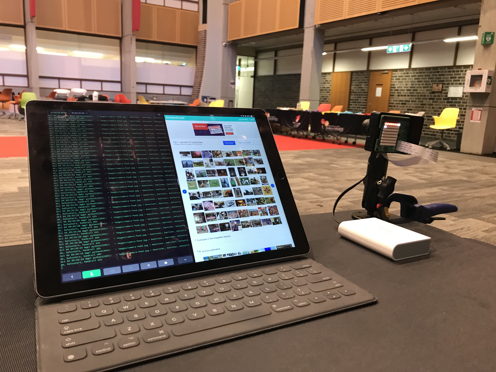

Students retrain an exising model to detect items in their current space.  Students try things that differ by a large amount, things that differ by a small amount, things that are large and things that are small.  The resulting artificial intelligence seems brilliant, until you start poking at the edges...

# Two Activities

This demonstration/workshop contains two activities, side by side:
  * ImageNet Demo
  * Train your own AI

## ImageNet Demo

{: style="float:right" width="400px"}

You will need:
  * A Raspberry Pi with a camera and sense-hat.
  * A battery and micro usb cable (usb c for Pi4)
  * An "mq-pi-stage4" sd card
  * Some device with a terminal emulator (window/putty, macos, ios/terminus)

You should boot the pi with the "mq-pi-stage4" sd card.  It will start up with a "?" on the display.  You are in the menu.  From here you can:
  * see the IP (assuming networking was properly setup)
  * see the camera focus interface
  * stream the camera feed
  * run the "covered-uncovered" AI model
  * run the ImageNet AI model (Inception V4).

The steps to set up the demo are:
  1. Plug in the Pi and start it up - have it display its ip
  2. connect to the pi with ssh (pi/mqpi) from the laptop.  
  3. run `journalctl -f -u choose-action.service` to start watching the ouput from the pi demo
  4. Use the pi joystick to select the ImageNet menu item and press the joystick in.

Image net will start running and making predictions about what it can see.  It won't be accurate, but it will be interesting.  If you have a pi HD camera, you should take the time to focus (using the camera stream or the focus interface) before starting the image net model

## Train your own AI

  1. Open [Teachable Machine](https://teachablemachine.withgoogle.com/train) and login with a google account
  2. Choose a new image project
  3. Demonstrate retraining the model to recognise _your_ presence.  I.e train it with images where the instructor is present, and then where no one is present.  The resulting model should be quite accurate
  4. Start from a fresh model and train it to recognise each of the students.  The resulting model should actually focus on the student's location in the frame and you can get it to confuse one with another by having them sit in the frame like each other did.
  5. Start from a fresh model and train it on small objects like phones and water bottles.  The model will be able to tell an object from no object, but the objects themselves will get mixed up a lot because the model is probably focussing on the hand holding the model.